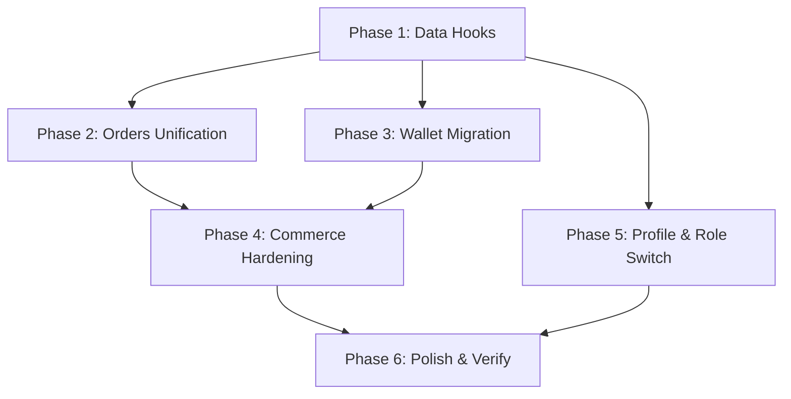

# DELGATO — Flow Implementation Masterplan

**Created**: 2026-05-24  **Revised**: 2026-05-24 (v3 — final clarifications)
**Companion**: `DELGATO_FINAL_CANONICAL_APP_FLOW.md` v3

---

## 0. Corrections Applied

| # | Directive | What Changed |
|---|---|---|
| 1 | No overengineering | Removed `DiscoveryRepository`, `LoyaltyRepository`, `FavoritesRepository`. Screens use existing repos + catalog seed behind thin query hooks. |
| 2 | Transport-agnostic realtime | All references to WebSocket removed from domain/screens. `RealtimeClient` is the only contract. |
| 3 | Provider-agnostic payment | `PaymentRepository` accepts opaque `token: string`. No PSP types in domain. |
| 4 | Cart scoped on role switch | Cart is customer-scoped storage. Inaccessible from merchant shell. Not cleared on switch. |
| 5 | MVP / POST-MVP / LATER labels | Every phase and screen tagged. Scope clearly separated. |
| 6 | Navigation architecture | State machine handles only boot/auth/role/session/fatal. Feature nav is router-driven. Removed state machine events from commerce flows. |
| 7 | Mock ↔ backend DTO parity | Mock repos must return shapes matching intended API response contracts. Error types match API error codes. |
| 8 | Identity boundaries | Documented: single binary, shared auth, customer-only wallet, shared notification namespace, role-agnostic session token. |

---

## 0.1 Current State — Precise Inventory

### What Works Correctly

| Component | Location | Status |
|---|---|---|
| AppStateMachine | `src/runtime/AppStateMachine.ts` | ✅ Complete |
| RoutingResolver | `src/runtime/RoutingResolver.ts` | ✅ Complete |
| RouteGuard | `src/runtime/RouteGuard.tsx` | ✅ Complete |
| BootSequence | `src/runtime/BootSequence.ts` | ✅ Complete |
| PendingDeepLink | `src/runtime/PendingDeepLink.ts` | ✅ Complete (queue API ready, consumers POST-MVP) |
| DI Container | `src/infrastructure/container.ts` | ✅ 18 repos wired |
| Repository Interfaces (18) | `src/domain/repositories/` | ✅ All defined |
| Mock Repos (18) | `src/infrastructure/repositories/mock/` | ✅ All implemented |
| EventBus | `src/infrastructure/events/` | ✅ Typed, handlers registered |
| RealtimeClient (interface) | `src/domain/repositories/RealtimeClient.ts` | ✅ Transport-agnostic |
| MockRealtimeClient | `src/infrastructure/realtime/MockRealtimeClient.ts` | ✅ In-memory pub/sub |
| Domain Types (20 files) | `src/domain/types/` | ✅ Complete |
| Onboarding Screens (8) | `app/(onboarding)/` | ✅ Wired via state machine |
| Merchant Screens (8) | `app/(merchant)/` | ✅ Wired |
| placeOrder Pipeline | `src/features/checkout/placeOrder.ts` | ✅ Cash/card/wallet paths |
| Tracking Screen | `app/tracking.tsx` | ✅ Reads platformStore, real-time |
| Feature Flags | `src/infrastructure/featureFlags.ts` | ✅ runtimeV2 ON |
| 54 screen files exist | `app/**/*.tsx` | ✅ All routes created |

### What Needs Fixing

| Issue | Severity | Scope Label | Root Cause |
|---|---|---|---|
| **21 screens import `features/catalog/data`** (hardcoded seed) | 🔴 | `[MVP REQUIRED]` | Screens built with static arrays, never migrated |
| **8 screens import `useLoyaltyStore`** (shim store) | 🟡 | Mixed (wallet=MVP, points/rewards=POST-MVP) | Loyalty store predates WalletRepository |
| **`(tabs)/orders.tsx` uses `useOrdersStore`** | 🟡 | `[MVP REQUIRED]` | Legacy `OrderHistory` type, not domain `Order` |
| **Home refresh is `setTimeout(900)`** | 🟠 | `[MVP REQUIRED]` | Fake, not a real data fetch |
| **No cart revalidation at checkout** | 🟡 | `[MVP REQUIRED]` (minimal) | Minimal availability check required at MVP per clarification. Full diff UX is POST-MVP. |
| **Cart not scoped by userId** | 🔴 | `[MVP REQUIRED]` | Global Zustand store, must be scoped to `delgato.cart.{userId}` |
| **No role-switch tile in profile** | 🟠 | `[MVP REQUIRED]` | Missing for dual-role users |
| **Notifications screen hardcoded** | 🟠 | `[POST-MVP]` | Uses catalog data types |
| **DeepLinkRouter not wired** | 🟠 | `[POST-MVP]` | Queue exists, nothing feeds it |
| **`mirrorLegacy()` in placeOrder** | 🟠 | `[MVP REQUIRED]` | Mirror to legacy store should be removed after orders tab migrated |

---

## 1. Phases

### Dependency Graph



> **POST-MVP phases** (not detailed here, tracked separately):
> - Deep links & push consumption
> - Cart revalidation (price/stock diff modals)
> - Refund workflows
> - Review/rating submission
> - Chat system
> - SLA auto-reject (backend)
> - Points/rewards/referral/cashback
> - Advanced analytics
> - Staff management
> - Payout automation
> - Notification settings
> - Saved cards / payment methods

---

## Phase 1 — Data Hooks + Cart Scoping (Static → Repository) `[MVP REQUIRED]`

### Goal

Migrate the 21 screens that import `features/catalog/data` to read from repositories via thin query hooks. Scope the cart store by `userId`. **No new repository interfaces.** Existing repos already cover the needed operations.

### Strategy: Query Hooks, Not New Repos

Instead of creating `DiscoveryRepository` (overengineering — there's no separate discovery service), create **query hooks** that call existing repositories:

```
useShopList(filter?)     → calls MerchantRepository.list(filter)
useShopDetail(id)        → calls MerchantRepository.byId(id)
useProductList(storeId)  → calls ProductRepository.listForStore(storeId)
useProductDetail(id)     → calls ProductRepository.byId(id)
usePromotionList()       → calls PromotionRepository.list()
useReviewList(storeId)   → calls ReviewRepository.forStore(storeId)
useCategoryList()        → calls CategoryRepository.list()
```

These hooks:
- Use `@tanstack/react-query` (already installed)
- Call `getContainer().someRepo.method()` internally
- Return `{ data, isLoading, error, refetch }`
- Mock repos already return seed data shaped correctly

### Important: Mock ↔ Backend DTO Contract

Mock repositories MUST return objects matching the intended backend response schema:

```typescript
// ✅ CORRECT: Mock returns same shape as API will
MockMerchantRepository.list() → Promise<{ items: Store[], total: number, cursor?: string }>

// ❌ WRONG: Mock returns a different structure than API
MockMerchantRepository.list() → Promise<Store[]>  // missing pagination metadata
```

Each mock method should have a comment documenting the equivalent API endpoint:
```typescript
/** GET /api/v1/stores?lat={lat}&lng={lng}&radius={radius}&cursor={cursor} */
async list(filter?: StoreFilter): Promise<PaginatedResult<Store>> { ... }
```

### Files to CREATE

#### [NEW] `src/features/discovery/hooks.ts`
Query hooks wrapping existing repositories. Examples:
- `useShopList(filter?)` → `MerchantRepository.list(filter)`
- `useShopDetail(id)` → `MerchantRepository.byId(id)`
- `useProductsForStore(storeId)` → `ProductRepository.listForStore(storeId)`
- `useProductDetail(id)` → `ProductRepository.byId(id)`
- `useCategories()` → `CategoryRepository.list()`
- `useDeals()` → `PromotionRepository.listFeatured()`
- `useReviews(storeId)` → `ReviewRepository.forStore(storeId)`

No new interfaces, no new repos, no new domain types. Just hooks.

#### [NEW] `src/features/discovery/index.ts`
Export barrel.

### Files to MODIFY (21 screens)

Migration pattern for each screen:

**Before:**
```tsx
import { SHOPS, PRODUCTS } from '@/features/catalog/data';
const shops = SHOPS.filter(s => s.catKey === cat);
```

**After:**
```tsx
import { useShopList } from '@/features/discovery/hooks';
const { data: shops, isLoading } = useShopList({ category: cat });
```

Each screen gains:
- Loading state (skeleton or spinner)
- Error state (retry banner)
- Data from repository (via hook)

| Screen | Replace | With | Priority |
|---|---|---|---|
| `(tabs)/home.tsx` | `CATEGORIES, SHOPS` | `useShopList()`, `useCategories()` | P0 |
| `(tabs)/search.tsx` | `PRODUCTS, SHOPS, CATEGORIES` | `useShopList()`, `useProductsForStore()` | P0 |
| `shop.tsx` | `PRODUCTS, SHOPS` | `useShopDetail(id)`, `useProductsForStore(id)` | P0 |
| `product.tsx` | `PRODUCTS, SHOPS` | `useProductDetail(id)` | P0 |
| `category.tsx` | `CATEGORIES, SHOPS` | `useShopList({category})` | P0 |
| `deals.tsx` | `DEALS` | `useDeals()` | P0 |
| `featured.tsx` | `FEATURED_IDS, SHOPS` | `useShopList({featured:true})` | P0 |
| `reviews.tsx` | `REVIEWS` | `useReviews(storeId)` | P1 |
| `customize.tsx` | `PRODUCT_ADDONS, PRODUCTS, SHOPS` | `useProductDetail(id)` | P1 |
| `similar.tsx` | `PRODUCTS, SHOPS` | `useProductsForStore(storeId)` (filter by category) | P1 |
| `unavailable.tsx` | `PRODUCTS, SHOPS` | `useProductDetail(id)`, `useShopDetail(shopId)` | P1 |
| `product-gallery.tsx` | `PRODUCTS` | `useProductDetail(id)` | P1 |
| `merchant-conflict.tsx` | `findProduct, findShop` | `useProductDetail()`, `useShopDetail()` | P1 |
| `contact-merchant.tsx` | `findShop` | `useShopDetail(shopId)` | P1 |
| `promo-code.tsx` | `DEALS` | `useDeals()` | P1 |
| `favorites.tsx` | `SHOPS` + cart favorites | `useShopList()` + local favorites | P2 |
| `nearby.tsx` | `SHOPS` | `useShopList()` | P2 |
| `recommendations.tsx` | `PRODUCTS, SHOPS` | `useShopList()` | P2 |
| `recently-viewed.tsx` | `PRODUCTS` | local IDs + `useProductDetail()` per item | P2 |
| `notifications.tsx` | catalog data types | `NotificationRepository.list()` (hook) | P2 |

### Files to MODIFY (repository methods — if missing)

#### [MODIFY] `src/domain/repositories/MerchantRepository.ts`
- Ensure `list(filter?: StoreFilter): Promise<PaginatedResult<Store>>` exists
- Ensure `byId(id): Promise<Store>` exists

#### [MODIFY] `src/domain/repositories/PromotionRepository.ts`
- Add `listFeatured(ctx?): Promise<Promotion[]>` if not present

#### [MODIFY] corresponding mock implementations
- Ensure return shapes match intended API responses (DTO parity)

### Mock DTO Audit Checklist

For each modified mock repo, verify:
- [ ] Response shape matches `GET /api/v1/{resource}` intended schema
- [ ] Error responses use `{ code: string, message: string, details?: Record }` format
- [ ] `ValidationError` throws include field-level errors matching API 400 format
- [ ] `ConflictError` throws include `{ conflictType, currentState }` matching API 409 format
- [ ] `NotFoundError` includes `{ resource, id }` matching API 404 format
- [ ] Pagination uses `{ items, total, cursor? }` matching API list format

### Acceptance Criteria
- [ ] Zero imports of `features/catalog/data` from `app/` screens
- [ ] All screens render identically with data from repos
- [ ] All screens show loading state while data resolves
- [ ] All screens show error state on repo failure
- [ ] Mock return types pass DTO parity check

### Cart userId Scoping (also in this phase)

The cart Zustand store must be scoped by `userId`, not global.

#### [MODIFY] `src/features/cart/store.ts`
- Change persistence key from `delgato.cart` to `delgato.cart.{userId}`
- Add `hydrateCartForUser(userId: string)` action — loads cart from `AsyncStorage` for the given user
- Add `clearCartInMemory()` action — clears in-memory state without deleting storage (used on logout / role-switch)
- On `auth.session-started`: call `hydrateCartForUser(userId)` to load the correct cart
- On `auth.session-ended`: call `clearCartInMemory()` — cart stays in storage under old userId key
- On role switch to merchant: call `clearCartInMemory()` — cart stays in storage, not loaded by merchant shell
- On role switch to customer: call `hydrateCartForUser(userId)` — reload customer's cart

#### Acceptance Criteria (Cart Scoping)
- [ ] User A's cart is NOT visible after User B logs in
- [ ] Logout preserves cart in storage for same user's next login
- [ ] Role switch to merchant clears cart from memory
- [ ] Role switch back to customer restores cart

---

## Phase 2 — Orders Unification `[MVP REQUIRED]`

### Goal

Replace the legacy `useOrdersStore` with `OrderRepository` reads. Kill the `OrderHistory` type. All order screens use domain `Order` type.

### Files to CREATE

#### [NEW] `src/features/orders/hooks.ts`
```typescript
useCustomerOrders(filter?)  → OrderRepository.listForCustomer(customerId, filter)
useOrderDetail(orderId)     → OrderRepository.byId(orderId) via platformStore
useLiveOrders()             → OrderRepository.listForCustomer(customerId, {status: LIVE_STATUSES})
```

### Files to MODIFY

#### [MODIFY] `app/(tabs)/orders.tsx`
- Replace `useOrdersStore` → `useCustomerOrders()`
- Use domain `Order` type
- Tabs: live vs done (by status filter)
- Tap live → `router.push('/tracking?orderId=...')` (router-driven, not state machine)
- Tap done → `router.push('/order-detail?orderId=...')`

#### [MODIFY] `app/(tabs)/home.tsx`
- Active order banner: `useLiveOrders()` instead of `useOrdersStore`

#### [MODIFY] `app/order-detail.tsx`
- Read from `useOrderDetail(orderId)` instead of any legacy store
- Reorder: read order items → validate → add to cart → `router.push('/cart')`
- No server-side `reorder()` endpoint at MVP

#### [MODIFY] `src/features/checkout/placeOrder.ts`
- Remove `mirrorLegacy()` entirely
- Remove `useOrdersStore.getState().addOrder()` call
- `OrderRepository.place()` already writes to platformStore

### Files to DELETE (after verification)

| File | Reason |
|---|---|
| `src/features/orders/store.ts` | All consumers migrated. Zero imports. |

### Acceptance Criteria
- [ ] `useOrdersStore` has zero imports across codebase
- [ ] Orders tab reads from `OrderRepository.listForCustomer()`
- [ ] Home active-order banner reads from `useLiveOrders()`
- [ ] `mirrorLegacy()` is deleted
- [ ] `features/orders/store.ts` is deleted
- [ ] Order detail shows domain `Order` data

---

## Phase 3 — Wallet Migration `[MVP REQUIRED]`

### Goal

Migrate wallet screens from `useLoyaltyStore` to `WalletRepository`. Points/rewards/cashback/referral stay on the legacy store for now (they are POST-MVP).

### Scope Boundary

| Screen | Scope | Action |
|---|---|---|
| `wallet.tsx` | `[MVP REQUIRED]` | Migrate to `WalletRepository.forUser()` + `.history()` |
| `wallet-history.tsx` | `[MVP REQUIRED]` | Migrate to `WalletRepository.history()` |
| `wallet-pay.tsx` | `[MVP REQUIRED]` | Already uses `WalletRepository.hold()` via placeOrder ✅ — just migrate balance display |
| `checkout.tsx` | `[MVP REQUIRED]` | Replace `useLoyaltyStore.walletBalance` with `WalletRepository.availableBalance()` |
| `(tabs)/profile.tsx` | `[MVP REQUIRED]` | Wallet quick-link balance from `WalletRepository.forUser()` |
| `points.tsx` | `[POST-MVP]` | Keep `useLoyaltyStore` |
| `rewards.tsx` | `[LATER]` | Keep `useLoyaltyStore` |
| `cashback.tsx` | `[POST-MVP]` | Keep `useLoyaltyStore` |
| `referral.tsx` | `[POST-MVP]` | Keep `useLoyaltyStore` |

### Files to CREATE

#### [NEW] `src/features/wallet/hooks.ts`
```typescript
useWallet(userId)         → WalletRepository.forUser(userId)
useWalletHistory(userId)  → WalletRepository.history(userId)
useWalletBalance(userId)  → WalletRepository.availableBalance(userId) — derived from forUser
```

### Files to MODIFY

#### [MODIFY] `app/wallet.tsx`
- Replace `useLoyaltyStore` reads with `useWallet()` and `useWalletHistory()`
- Keep TopupSheet but wire `WalletRepository.topUp()` instead of `useLoyaltyStore.topUp()`
- Payment token for top-up is provider-agnostic: opaque string from card form

#### [MODIFY] `app/wallet-history.tsx`
- Replace `useLoyaltyStore.walletTx` with `useWalletHistory()`

#### [MODIFY] `app/checkout.tsx`
- Replace `useLoyaltyStore.walletBalance` with `useWalletBalance()`

#### [MODIFY] `app/(tabs)/profile.tsx`
- Wallet balance quick-link: `useWalletBalance()`

#### [MODIFY] `src/features/loyalty/TopupSheet.tsx`
- Replace `useLoyaltyStore.topUp()` with `getContainer().walletRepo.topUp()`

### Mock DTO Audit

#### [MODIFY] `src/infrastructure/repositories/mock/MockWalletRepository.ts`
Verify:
- `forUser(userId)` returns `{ balance, currency, lastUpdated }` matching `GET /api/v1/wallet`
- `history(userId)` returns `{ items: WalletTransaction[], cursor? }` matching `GET /api/v1/wallet/history`
- `topUp(input)` accepts `{ amount, paymentToken }` matching `POST /api/v1/wallet/topup`
- No PSP-specific types. `paymentToken` is opaque.

### DO NOT DELETE `useLoyaltyStore` YET

Points/rewards/cashback/referral screens still use it. It will be cleaned up when those features are properly built (POST-MVP).

### Acceptance Criteria
- [ ] Wallet screen reads from `WalletRepository`
- [ ] Top-up calls `WalletRepository.topUp()`
- [ ] Checkout wallet balance from `WalletRepository`
- [ ] Profile wallet quick-link shows live balance
- [ ] Points/rewards/cashback/referral still work via `useLoyaltyStore`

---

## Phase 4 — Commerce Hardening `[MVP REQUIRED]`

### Goal

Harden the checkout → order-success → tracking pipeline for production correctness.

### Files to MODIFY

#### [MODIFY] `app/checkout.tsx`
- **MVP availability check**: Before `placeOrder()`, call `ProductRepository.checkAvailability(productIds)`. If any item is unavailable, show blocking alert listing the unavailable items. User must remove them from cart before proceeding. This is NOT the full diff UX — no price-change detection, no line-by-line modal. Just: "are these products still available? yes/no."
- Idempotency: generate key from cart hash + timestamp. Pass to `placeOrder()`. Double-tap produces same order.
- Payment timeout: 15s for card authorization. On timeout, treat as failure, show error.
- Missing address: if no address selected, route to address-setup flow (router-driven), return.
- Disable "place order" when offline.

#### [MODIFY] `src/domain/repositories/ProductRepository.ts`
- Add `checkAvailability(productIds: Id[]): Promise<{ available: Id[], unavailable: Id[] }>` method.
- This is a lightweight batch check. No prices, no full product data. Just availability status.
- Mock: checks in-memory product records. Production: `POST /api/v1/products/check-availability`.

#### [MODIFY] `src/infrastructure/repositories/mock/MockProductRepository.ts`
- Implement `checkAvailability()`: return all as available unless product has `available: false`.

#### [MODIFY] `app/payment.tsx`
- 15s timeout on `PaymentRepository.authorize()`.
- On timeout or decline: stay on screen, show provider-agnostic error message (no PSP-specific error strings in UI).
- Error display: `t('payment.declined')` or `t('payment.timeout')`. No raw PSP error messages.

#### [MODIFY] `app/tracking.tsx`
- Verify: NO local timers. ✅ Already uses platformStore subscription.
- Add offline stale marker: if `RealtimeClient.status === 'disconnected'`, show "آخر تحديث" with timestamp.
- Courier card: show at `picked` status with driver name (from Order.driverName).

#### [MODIFY] `src/features/checkout/placeOrder.ts`
- Accept idempotency key parameter.
- Pass to `OrderRepository.place()`.

#### [MODIFY] `src/domain/repositories/OrderRepository.ts`
- Ensure `place()` accepts optional `idempotencyKey: string` parameter.
- Document: backend returns existing order on duplicate key instead of creating new.

#### [MODIFY] `MockOrderRepository.ts`
- Implement idempotency: store last `(idempotencyKey → orderId)` mapping. Return same order on repeat.

### Payment Lifecycle (authorize-then-capture-on-delivery)

Per § 0.1.2 of the canonical flow:

| Event | System Action |
|---|---|
| Customer taps "Place Order" (card) | Client calls `PaymentRepository.authorize(token, amount, orderRef)` → hold placed. Client calls `OrderRepository.place(payment:{method:'card', ref})`. |
| Customer taps "Place Order" (wallet) | Client calls `WalletRepository.hold(userId, amount)` → hold placed. Client calls `OrderRepository.place(payment:{method:'wallet', holdRef})`. |
| `order.delivered` event | **System-driven handler** calls `PaymentRepository.capture(ref)` or `WalletRepository.capture(holdId)`. Client does NOT call this. |
| `order.cancelled` / `order.rejected` | **System-driven handler** calls `PaymentRepository.release(ref)` or `WalletRepository.releaseHold(holdId)`. Client does NOT call this. |

At MVP, these capture/release handlers exist in the mock event handler layer. Production wiring is backend work.

#### [NEW] `src/infrastructure/events/handlers/paymentLifecycle.ts`
- Handler for `order.delivered` → `paymentRepo.capture(order.payment.ref)` or `walletRepo.capture(holdId)`
- Handler for `order.cancelled` → `paymentRepo.release(ref)` or `walletRepo.releaseHold(holdId)`
- Handler for `order.rejected` → same as cancelled
- Registered in `src/infrastructure/events/handlers/index.ts`

### NOT in this phase (POST-MVP)

- Full cart revalidation (price/stock diff modals at checkout) — MVP only checks availability
- Inventory conflict modals with line-by-line diff
- Session-expired-during-payment re-tokenization
- Refund processing on rejection (auto-release of hold IS in MVP; refund of already-captured payment is POST-MVP)

### Acceptance Criteria
- [ ] Checkout calls `ProductRepository.checkAvailability()` before place
- [ ] Unavailable items → blocking alert, cannot proceed
- [ ] Double-tap place order → same order returned
- [ ] Card authorization with 15s timeout
- [ ] Decline shows generic error, stays on payment
- [ ] Tracking shows stale marker when offline
- [ ] Tracking shows courier card at `picked`
- [ ] Missing address → address flow → return to checkout
- [ ] `order.delivered` event triggers capture (mock handler)
- [ ] `order.cancelled` event triggers release (mock handler)

---

## Phase 5 — Profile & Role Switch `[MVP REQUIRED]`

### Goal

Wire profile sub-screens to repositories and implement role-switch for dual-role users.

### Files to MODIFY

#### [MODIFY] `app/(tabs)/profile.tsx`
- Add "Switch to merchant" tile (visible if `user.roles.includes('merchant')`)
- On tap: confirm dialog → `dispatchAppEvent({ type: 'role.switch_requested' })` → state machine handles
- Cart scoping: customer cart stays in customer-scoped storage, inaccessible from merchant shell

#### [MODIFY] `app/(merchant)/(tabs)/settings.tsx`
- Add "Switch to customer" tile (if dual-role)
- Same state-machine-driven flow

#### [MODIFY] `app/edit-profile.tsx`
- Wire name/email update through `AuthRepository.updateProfile()`
- MVP: name + email only. No phone change (requires re-verification, POST-MVP).

#### [MODIFY] `app/addresses.tsx`
- Wire `AddressRepository.list()`, `.add()`, `.update()`, `.remove()`

#### [MODIFY] `app/language.tsx`
- Wire `i18n.changeLanguage()` + RTL flip
- Persist preference to `useSettingsStore`

#### [MODIFY] `app/support.tsx`
- MVP: FAQ list (static) + contact links (phone, email, WhatsApp)
- POST-MVP: in-app ticket creation

### Role Switch Implementation Detail

The role switch is one of the few in-READY transitions that the state machine handles:

1. User taps "Switch to merchant" in profile
2. Confirm dialog (router-driven: `Alert.alert`)
3. On confirm: `dispatchAppEvent({ type: 'role.switch_requested', toRole: 'merchant' })`
4. AppStateMachine: `READY{customer} → ROLE_TRANSITION → READY{merchant}`
5. RouteGuard: sees READY{merchant} → `router.replace('/(merchant)/(tabs)/dashboard')`
6. Customer cart: stays in `delgato.cart.{userId}` (persisted). Cart store calls `clearCartInMemory()`. Not loaded by merchant shell.
7. On return to customer: `READY{customer}` → `router.replace('/(tabs)/home')` → cart store calls `hydrateCartForUser(userId)` → cart is available.

#### [MODIFY] `src/runtime/AppStateMachine.ts`
- Add `role.switch_requested{toRole}` event
- Add `ROLE_TRANSITION` transient state (if not already present)
- Transition: `READY{*} →[role.switch_requested]→ ROLE_TRANSITION →[auto]→ READY{toRole}`

#### [MODIFY] `src/runtime/RoutingResolver.ts`
- Map `ROLE_TRANSITION` → splash (brief flash) or direct to target shell

### Acceptance Criteria
- [ ] Dual-role user sees "Switch" tile in both profiles
- [ ] Role switch navigates to correct shell via state machine
- [ ] Customer cart preserved after switch to merchant and back
- [ ] Cart NOT accessible from merchant shell
- [ ] Addresses CRUD works
- [ ] Language switch works with RTL flip
- [ ] Edit profile saves name/email

---

## Phase 6 — Polish & Verification `[MVP REQUIRED]`

### Goal

Delete dead code, verify all MVP flows end-to-end, ensure design parity.

### Files to DELETE

| File | Condition | Reason |
|---|---|---|
| `src/features/orders/store.ts` | Zero imports | Replaced by OrderRepository |
| Legacy routing in `app/index.tsx` | After verification | The `if (!featureFlags.runtimeV2)` block |

### Files to MODIFY

#### [MODIFY] `app/index.tsx`
- Remove legacy routing fallback (L27-88). Splash is purely visual.
- Keep brand reveal animation.

### DO NOT DELETE (still consumed)

| File | Reason |
|---|---|
| `src/features/loyalty/store.ts` | Points/rewards/cashback/referral screens (POST-MVP) |
| `src/features/catalog/data.ts` | Should now have zero screen consumers. Verify. If clear, delete. If mock repos still seed from it, keep as seed data source. |

### Verification Checklist

#### Architecture Validation
- [ ] Zero `features/catalog/data` imports from `app/` screens
- [ ] Zero `useOrdersStore` consumers
- [ ] State machine only handles: boot/auth/role/session/fatal
- [ ] All commerce navigation is router-driven
- [ ] All mock repos return DTO-parity shapes
- [ ] Payment lifecycle: authorize-hold at checkout, capture on delivery, release on cancel/reject (see § 0.1.2)
- [ ] Payment contract has no PSP-specific types
- [ ] RealtimeClient references are transport-agnostic (no WebSocket mentions in domain/screens)
- [ ] Cart is userId-scoped (`delgato.cart.{userId}`)
- [ ] Cart is customer-scoped (no merchant shell access)
- [ ] Checkout performs availability check before placeOrder
- [ ] Dashboard KPIs derived from OrderRepository (no analytics infrastructure)

#### MVP E2E Critical Paths

| # | Path | Steps |
|---|---|---|
| 1 | First-run → first order | Boot → intro → register → OTP → address → home → shop → add to cart → checkout → cash → order-success → tracking |
| 2 | Returning customer → reorder | Boot → biometric → home → orders tab → order detail → reorder → cart → checkout → success |
| 3 | Merchant accepts → customer sees | Merchant orders → accept → customer tracking advances |
| 4 | Merchant rejects → customer sees | Merchant orders → reject → customer sees rejection |
| 5 | Dual-role switch | Customer profile → switch → merchant dashboard → switch → customer home (cart preserved) |
| 6 | Session expired | API call → 401 → refresh fails → modal → re-auth → returnTo |
| 7 | Card payment decline | Checkout → card → payment screen → decline → error → stay on payment |
| 8 | Customer cancel | Tracking → cancel → confirm → order cancelled |
| 9 | Offline at boot | No network → banner → persisted data visible → actions disabled |
| 10 | Logout → re-login | Profile → logout → welcome → login → OTP → home |

#### Visual Regression (MVP screens only)

- [ ] Onboarding: intro, welcome, auth, register, otp, location, address, biometric
- [ ] Customer tabs: home, search, orders, profile
- [ ] Commerce: shop, product, customize, product-gallery, cart, merchant-conflict, checkout, payment, wallet-pay, order-success, tracking
- [ ] Extras: deals, featured, category, promo-code, delivery-notes, unavailable
- [ ] Profile: edit-profile, addresses, language, support, wallet, wallet-history
- [ ] Merchant: dashboard, orders, products, settings, catalog
- [ ] System: locked, session-expired, role selection

---

## Summary

| Phase | Goal | Scope | New | Modified | Deleted |
|---|---|---|---|---|---|
| 1 | Data hooks + cart scoping | `[MVP]` | 2 | ~25 | 0 |
| 2 | Orders unify | `[MVP]` | 1 | 4 | 1 |
| 3 | Wallet migrate | `[MVP]` | 1 | 5 | 0 |
| 4 | Commerce harden | `[MVP]` | 1 | 8 | 0 |
| 5 | Profile + role switch | `[MVP]` | 0 | 8 | 0 |
| 6 | Polish + verify | `[MVP]` | 0 | 1 | 1–2 |
| **Total MVP** | | | **5** | **~51** | **2–3** |

### POST-MVP Backlog (not in this plan)

| Feature | Scope |
|---|---|
| Deep link consumption + push routing | `[POST-MVP]` |
| Cart revalidation (price/stock diff) | `[POST-MVP]` |
| Refund workflow | `[POST-MVP]` |
| Review/rating submission + 24h window | `[POST-MVP]` |
| Invoice generation | `[POST-MVP]` |
| Notification settings | `[POST-MVP]` |
| Payment methods (saved cards) | `[POST-MVP]` |
| Favorites (proper repository) | `[POST-MVP]` |
| Advanced analytics | `[POST-MVP]` |
| Promotions CRUD | `[POST-MVP]` |
| Payouts display | `[POST-MVP]` |
| Delete account | `[POST-MVP]` |
| Biometric re-prompt on warm start | `[POST-MVP]` |
| Merchant temp close | `[POST-MVP]` |
| SLA auto-reject (backend) | `[POST-MVP]` |
| Chat (driver/merchant) | `[LATER]` |
| Staff management | `[LATER]` |
| Rewards catalog | `[LATER]` |
| Payout automation | `[LATER]` |
| Forced app update | `[LATER]` |
| Points/tier system | `[LATER]` |
| Recommendation engine | `[LATER]` |
| Nearby (location-based discovery) | `[POST-MVP]` |

---

## Strict Rules (Unchanged)

1. No screen self-routes for app-level transitions — state machine handles boot/auth/role/session/fatal
2. Feature navigation is router-driven — no state machine events for shop→product→cart
3. No new repository interfaces unless actively consumed by MVP screens
4. Mock repos return DTO-parity shapes with documented API endpoint comments
5. Payment contract is provider-agnostic — opaque tokens only
6. Realtime contract is transport-agnostic — `RealtimeClient` interface only
7. Cart is customer-scoped and userId-keyed (`delgato.cart.{userId}`) — inaccessible from merchant shell
8. No local timers for order status — realtime subscription only
9. Idempotent mutations — double-tap protection on all write operations
10. Error types match intended API error codes
11. Payment lifecycle: authorize-hold at checkout, capture/release are system-driven event handlers (§ 0.1.2)
12. Checkout must validate item availability before placeOrder (minimal check, not full diff)
13. Dashboard KPIs derived from OrderRepository — no analytics infrastructure at MVP
14. Merchant auth: phone+password with OTP step-up for new devices. Password on MerchantProfile, not User. (§ 0.1.1)

---

*End of implementation masterplan v2.*
